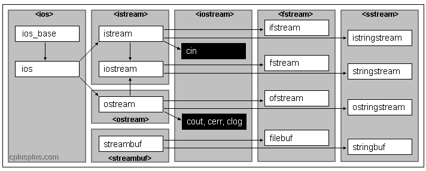

## c语言读写文件

打开，关闭文件： fopen, fclose

移动光标： fseek

+ 读取txt文件内容：fgetc, fgets, fscanf

```c++
#include <stdio.h>
#include <stdlib.h>
int main(void) {
    FILE* fp = fopen("E:\\technique doc\\embeded-notebook\\c c++\\file\\test.txt", "r+");
    char c;
    while( (c = fgetc(fp)) != EOF) {    //使用fgetc 每次读取文件的一个字符
        printf("%c", c);
    }

    printf("\n\n");
    fseek(fp, 0, 0);    //将光标移动到文件头部
    
    char str[1024];
    while( fgets(str, 1024, fp) > 0) {  //每次读取一行，最后的换行符也读取进来
        printf("%s", str);
    }

    printf("\n\n");
    fseek(fp, 0, 0);
    while( fscanf(fp, "%s", str) > 0) {  // fscanf 遇到空格就停止了
        printf("%s\n", str);
    }

    fclose(fp);
    return 0;
}
```

+ 写入txt文件内容：fputc, fputs, fprintf

```c
#include <stdio.h>
#include <stdlib.h>
int main(void) {
    FILE* fp = fopen("E:\\technique doc\\embeded-notebook\\c c++\\file\\writeTest.txt", "w+");
    char str[1024] = "hello world\ni love you\nautor:thc\n";
    fseek(fp, 0, 0);            //设置光标位置为0
    fpos_t fpos;
    fgetpos(fp, &fpos);         //获取当前光标位置
    printf("fpos:%d\n", fpos);

    for(int i=0; str[i]!=0; i++) {
        fputc(str[i], fp);
    }
    
    fputs(str, fp);

    fprintf(fp, "%s", str);

    fgetpos(fp, &fpos);
    printf("fpos:%d\n", fpos);
    
    fclose(fp);
    return 0;
}
```

+ 读写.bin文件，一般可以用 fwrite, fread

```c
#include <stdio.h>
int main(void) {
    FILE* fp = fopen("E:\\technique doc\\embeded-notebook\\c c++\\file\\test.bin", "rwb+");
    fseek(fp, 0, 0);

    int array[] = {1, 2, 3, 6, 9};
    fwrite((char*)array, sizeof(int), sizeof(array)/sizeof(int), fp);

    fpos_t fpos;
    fgetpos(fp, &fpos);         //获取当前光标位置
    printf("fpos:%d\n", fpos);

    int array2[10];
    fseek(fp, 0, 0);

    fread(array2, sizeof(int), sizeof(array)/sizeof(int), fp);      //再读取数据
    for(int i=0; i<sizeof(array)/sizeof(int); i++) {
        printf("%d\t", array2[i]);
    }

    fclose(fp);
    return 0;
}
```

## c++ 读写文件

c++的各种stream关系如下图所示，读写文件相关操作可以使用fsteram, 继承了 ifsteram, ofstream



+ 读取文件示例，getline, get 

```c++
#include <iostream>
#include <fstream>
using namespace std;

int main(void) {

    fstream fs("E:\\technique doc\\embeded-notebook\\c c++\\file\\readTest.txt", ios::in);  //已经open, 或者使用open函数

    string line;
    while(getline(fs, line, '\0')) {
        cout << line << endl;
    }

    printf("\n\n");
    fs.clear();     //读到EOF, 清空流状态
    fs.seekg(0, ios::beg);  //设置光标到开头为止

    char c;
    while( fs.get(c) ) {
        cout << c;
    }

    //获取文件字节数
    fs.clear();
    fs.seekg(0, ios::end);
    int end = fs.tellg();
    printf("\n\nfile bytes:%d\n", end);


    fs.close();
    return 0;
}
```

+ 写入文件示例, write, put

```c++
#include <iostream>
#include <fstream>
using namespace std;

int main(void) {

    fstream fs("E:\\technique doc\\embeded-notebook\\c c++\\file\\writeTest.txt", ios::out);

    fs.seekp(0, ios::beg);
    char str[] = "hello world\ni love you\nauthor:thc\n";
    fs.write(str, sizeof(str)-1);

    for(int i=0; i<sizeof(str)-1; i++) {
        fs.put(str[i]);        
    }

    fs.close();
    return 0;
}
```

+ 二进制文件读写也是类似
+ 不懂的地方多看参考手册 https://cplusplus.com/